# Django E-commerce Shop
This Django-based E-commerce shop is a feature-rich web application that allows users to browse, shop, and make secure payments. Below is a comprehensive guide to the project, along with relevant screenshots.

**Book Reference:** [Django 4 by Example](https://www.packtpub.com/product/django-4-by-example-fourth-edition/9781801813051)

The book offers professionals level projects with detailed explanations, making it an invaluable resource for building robust Django applications.

## Screenshots

### 0) Homepage

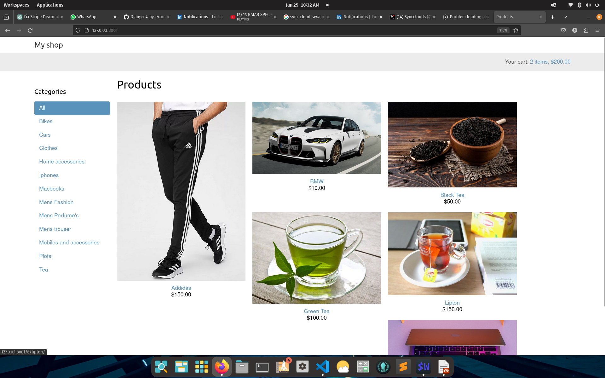

- The homepage showcases product categories and features a convenient shopping cart summary in the top right corner.

### 1) Purchase Process

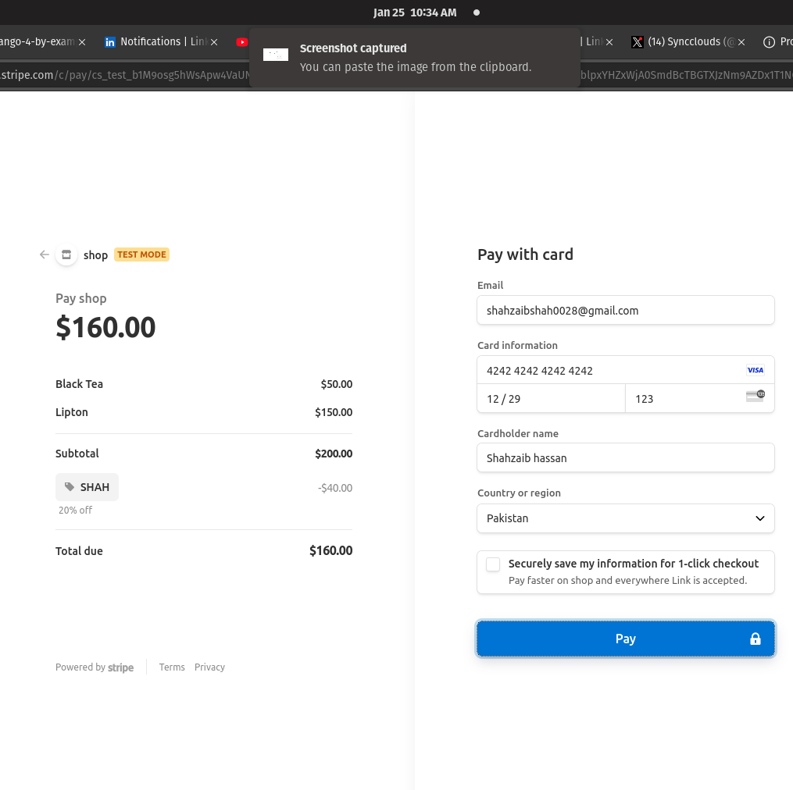

- The payment process involves Stripe integration, displaying discounts, and a detailed summary of the selected products.

### 2) Checkout Form

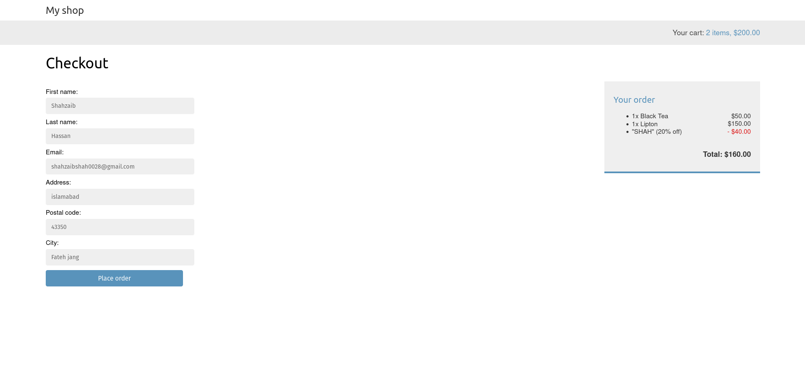

- The checkout page displays a detailed form for user information.

### 3) Shopping Cart

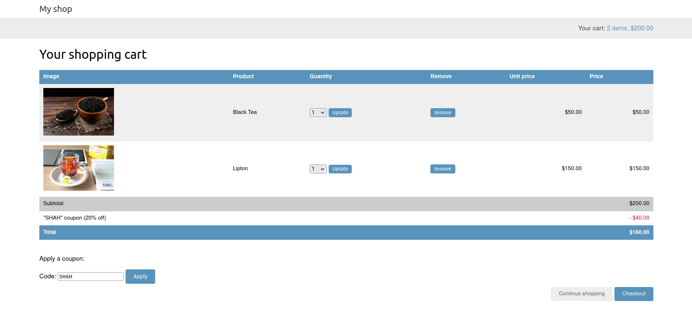

- The shopping cart page provides a detailed overview of the selected items.

### 4) Apply Coupon

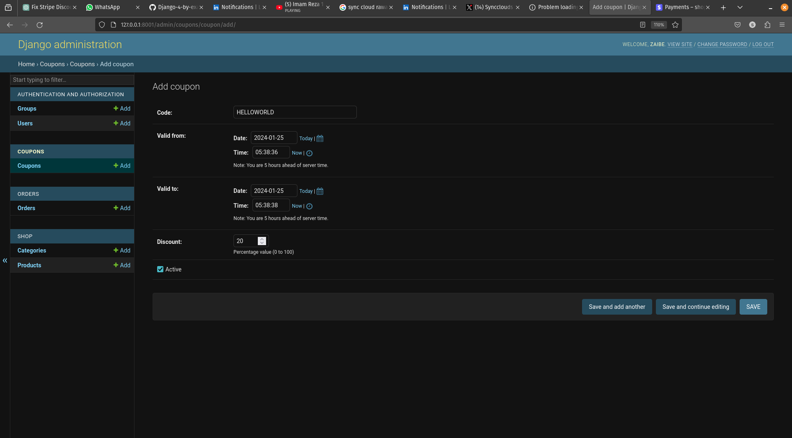

- Users can apply discounts using coupon codes during the checkout process.

### 5) Stripe Payment Method

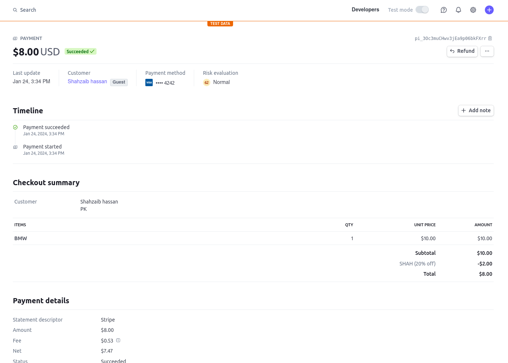
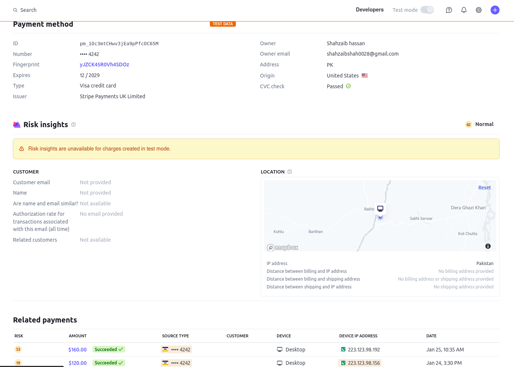

- Screenshots depicting the Stripe payment method, allowing users to securely enter card details.

### 6) Stripe Payment Card

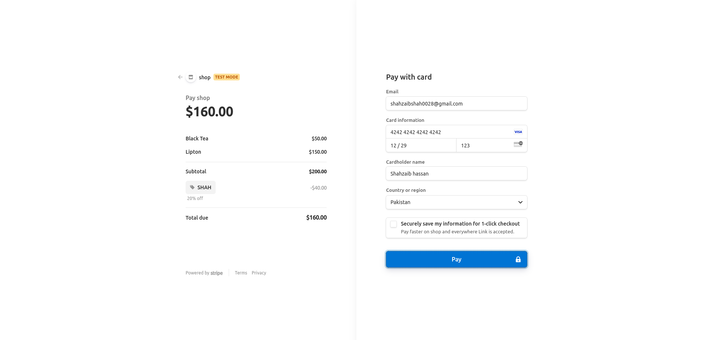

### 7) Stripe Test Environment

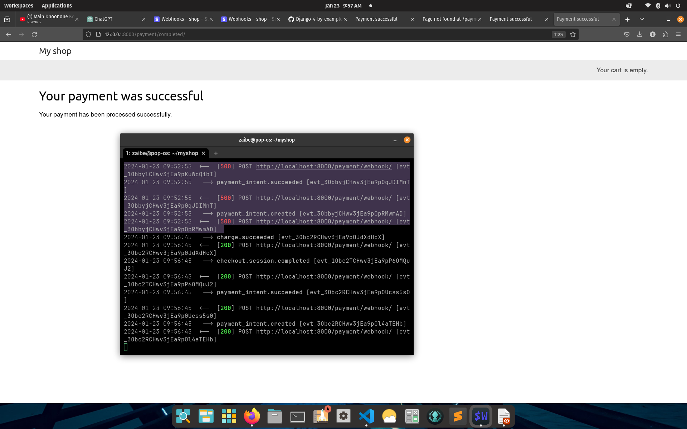

- Screenshots providing information about the Stripe payment integration.

### 8) PDF Invoice (Paid)

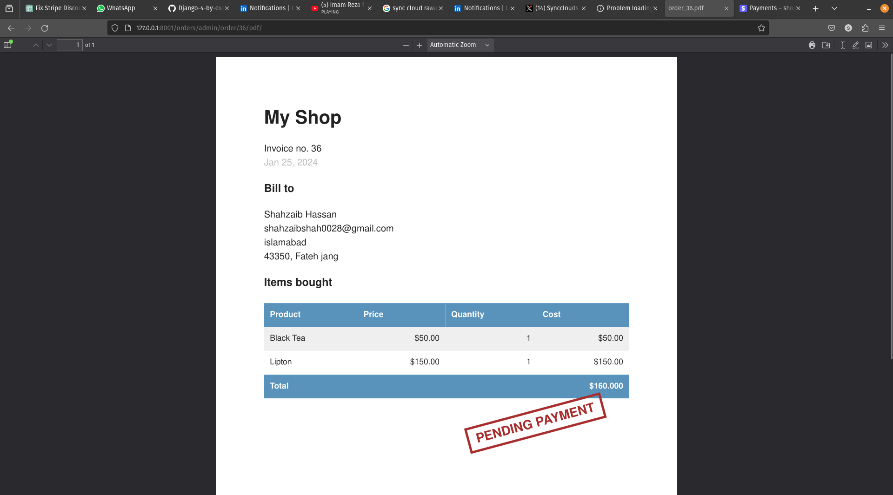

### 9) PDF Invoice (Unpaid)

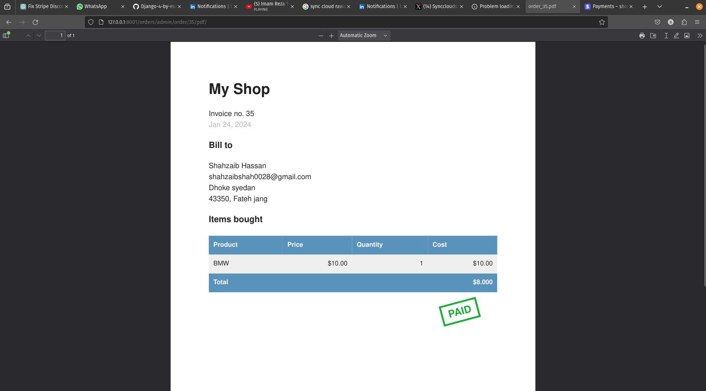

### 10) RabbitMQ and Celery

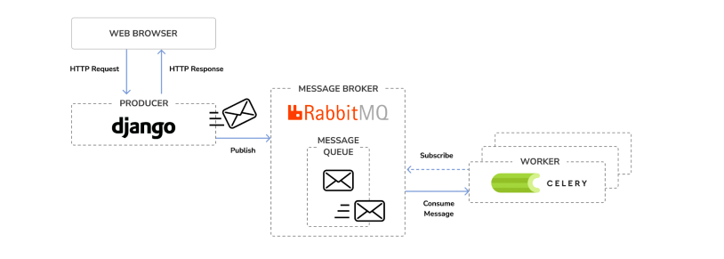

- Overview of RabbitMQ and Celery setup for background tasks.

### 11) Product Suggestions

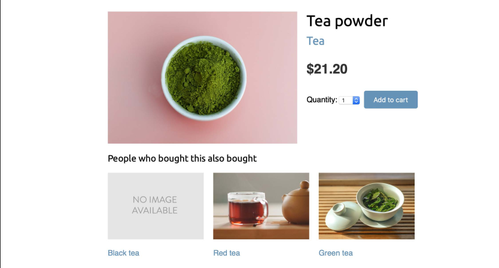

- Product suggestions powered by Redis.

### 12) RabbitMQ Interface

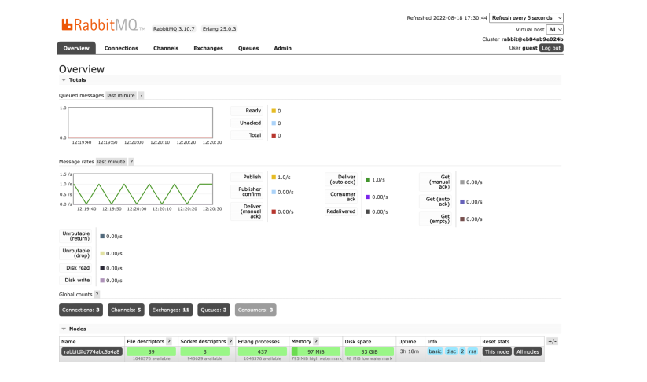

- Screenshot of the RabbitMQ interface.

### 13) Backend Orders

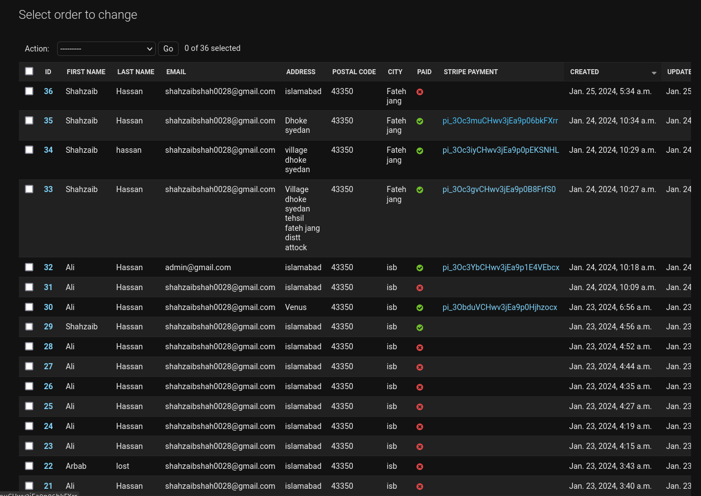

- Display of orders in the backend, including Stripe IDs and customer details.

### 14) Coupon Management

- Backend coupon creation and activation.

## Getting Started

1. Clone the repository: `git clone <repository_url>`
2. Navigate to the project directory: `cd myshop`
3. Run the development server: `python manage.py runserver`
4. Install required libraries: `pip install -r requirements.txt`

## Additional Notes

- Ensure that Redis is properly configured for optimal performance.
- The application utilizes Celery and RabbitMQ for background task processing.
- PDF invoices are generated for both paid and unpaid orders.

Feel free to explore and enhance the project based on your requirements. If you encounter any issues, please refer to the documentation or reach out for support.

Happy coding!

